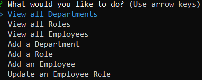

# Employee Tracker

---
## Table of Contents
* [Description](#description)
* [Usage](#usage)
* [Contributing](#contributing)
* [Tests](#tests)
* [Licence](#licence)
* [Questions](#questions)

---
## Description
Looking for a simple and easy-to-use command line tool to manage your employee database? Look no further than our Employee Database CLI! With just a few simple commands, you can add, remove, and update employee records, view employee information, and manage employee roles and departments. Try our Employee Database CLI today and take the hassle out of managing your employee records!

View the walk through video [here](https://youtu.be/BHv4CvYB7cQ)

 >

[BACK TO TOP](#top)

---
## Usage
In the command line enter **npm start** to start the server application. Then in another terminal run **node index.js** to star the application.  Answer the prompts in your command line to start building your employee database!

[BACK TO TOP](#top)

---
## Contributing
We welcome and encourage contributions from the community. If you are interested in contributing to this project, you can help by contributing code by forking the repository, making your changes, and submitting a pull request. Thank you for considering a contribution to this project!

[BACK TO TOP](#top)

---
## Tests
Test scripts were not included in this project.

[BACK TO TOP](#top)

---
## Licence
This project is licenced by MIT License

[BACK TO TOP](#top)

---
## Questions
Please visit my [GitHub Profile](https://github.com/teriannephillips)

[E-mail me](mailto:phillips.terianne@gmail.com) if you have any further questions!

[BACK TO TOP](#top)